# XJTU热重实验分析绘图

> 能动B2104 杨牧天

***本工具为个人开发，有bug勿喷***

项目地址:[https://github.com/proletarianwarrior/TGAreporter](https://github.com/proletarianwarrior/TGAreporter)

## 快速开始

1. **将项目`clone`至本地，创建脚本`test.py`**
2. **在脚本中写入：**

```python
from pathlib import Path

from FilterParameterSelect import select_filter_param
from FeaturePointSelect import select_feature_points
from PowerIntervalSelect import select_power_interval
from DocReporter import create_doc
```

导入所需模块

3. **进行滤波参数的选择，写入并运行：**

```python
file_path = Path('./data/ymt.txt') # 以作者数据为例
select_filter_param(file_path, method='butter')  # 滤波参数选择器,以butter滤波器为例，也可通过输入inertial参数选择惯性滤波
```

运行结果如下：

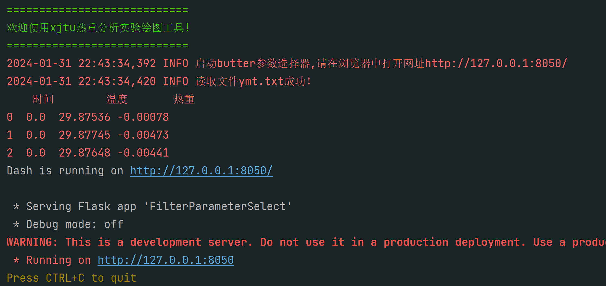

> 不需要管下方的WARNING

进入结果中提示的网址，界面如下：

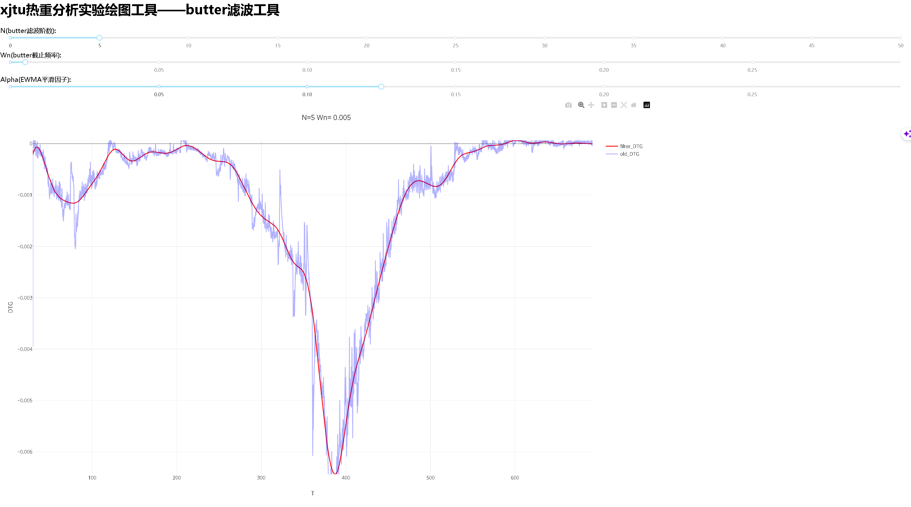

通过拖动上方三条`slider`改变滤波的参数，达到较为理想的滤波效果（如上图所示）,**关闭界面，结束运行**。

4. **进行特征点的选择，写入并运行：**

```python
select_feature_points(file_path)  # 特征点选择器
```

> 请注意根据要求输入试样质量和选择滤波器（只有在初始化或者更换原始数据时才会选择）
>
> 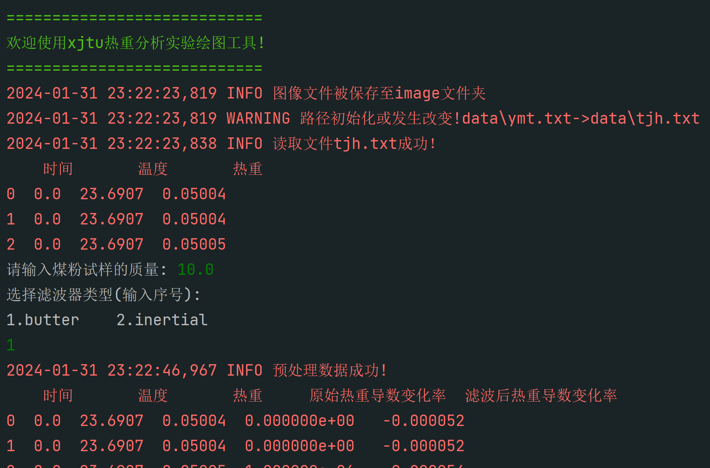
>
> 

与第三步操作相同，打开结果中提示的网址，界面如下：

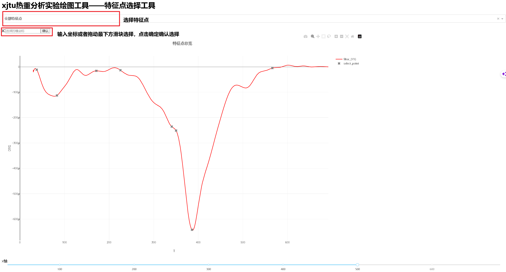

页面默认为总览页面，可通过最上方的选择框选择指定的特征点，当选择指定特征点时页面如下所示：

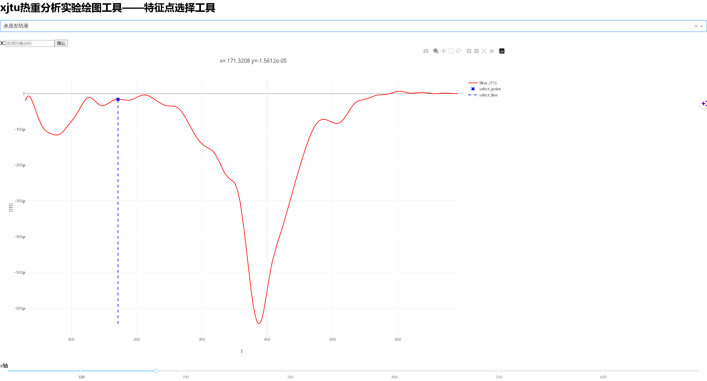

**注意，水析出特征点为蓝色、煤热解特征点为棕色、碳燃烧特征点为黑色**。

通过在输入框中输入坐标或者拖动下方滑条选择点的位置，最后**点击确定**确认选择。

选择完成后**退出界面，结束运行**，最终生成文件`feature_points.json`

5. **进行动力区间的选择，写入并运行：**

```python
select_power_interval(file_path)  # 动力反应区间选择器
```

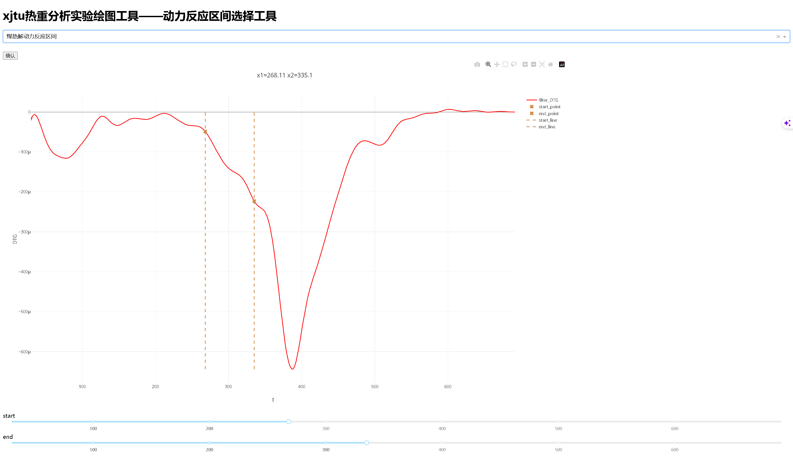

通过上方选择框和拖动下方两条滑条选择指定动力反应区间的开始和结束，选择完成后点击确认。**退出界面，结束运行**

6. **生成绘图报告，写入并运行：**

```python
create_doc(file_path)  # 生成绘图报告
```

绘图报告输出文件为：`repoter.docx`。**报告中包含实验报告中用到的数据信息和绘制的图像**。

**绘图报告的内容展示请见附录-绘图报告**

## 项目说明

### 项目结构

```shell
~:.
│  config.ini   # 配置文件    
│  DataLoader.py	# 文件导入和预处理模块
│  DataPloter.py	# 绘图模块
│  DocReporter.py		# 报告制作模块
│  FeaturePointSelect.py	# 特征点选择模块
│  feature_points.json	# 特征点数据
│  FilterParameterSelect.py	# 滤波器参数选择模块(支持butter滤波和惯性滤波)
│  Log.log # 日志文件
│  Logger.py # 日志配置脚本
│  PowerIntervalSelect.py # 动力区间选择模块
│  report.docx # 输出的报告
│  test.py # 测试脚本
│
│
├─data # 实验数据，来自能动B2104部分同学
│      ck.txt
│      error.txt
│      fcy.txt
│      fcy1.txt
│      fcy2.txt
│      pzc.txt
│      tjh.txt
│      wll.txt
│      ymt.txt
│      zdw.txt
│      zjz.txt
│
├─image # 绘制的图片
│      carbon_combustion.jpg
│      coal_pyrolysis.jpg
│      DTG-T.jpg
│      TG-DTG-T.jpg
│      TG-T.jpg
│
├─resource # 实验资料
│  │  参数设置方法.PNG
│  │  固体燃料热重分析实验指导书-2023. V1.0.pdf
│  │  数据导出方法.PNG
│  │  热重分析数据处理.pdf
│  │  附件：微机差热天平说明.pdf
│  │
│  └─matplotlib # matplotlib官方知识便签(可做参考)
│          cheatsheets.pdf
│          handout-beginner.pdf
│          handout-intermediate.pdf
│          handout-tips.pdf
│
├─unite # 不同用户数据信息
│      user1_unite.json
|	   user2_unite.json
|	   ... ... ... ...

```

> **使用时需在根目录中创建新的脚本编写程序**

### 配置文件的说明

```ini
[DataLoading]
# 原始数据路径
file_path = data\ymt.txt
# 签名
signature = 
	============================
	欢迎使用xjtu热重分析实验绘图工具!
	============================
# 学校机器默认编码
encoding = GB2312
# 学校机器默认列名(与默认列名不符会发出警告，这意味着文件可能有问题)
default_columns = 时间,温度,热重
# 学校机器默认分隔符
delimiter = ,

[DataProcess]
# 滤波器类型
method = butter
# 试样重量(mg)
weight = 10
# 采样间隔(s)
sep_time = 1
# 进行差分求导是否舍弃第一个数据
drop_first = False
# 处理后新的数据对应列名
new_columns = 原始热重导数变化率,滤波后热重导数变化率

# 滤波的参数
n = 5
wn = 0.005
btype = low
alpha = 0.125
a = 0.025

[DataPlot]
# 图片分辨率
dpi = 300
# 图片宽度(英尺)
width = 8
# 图片高度(英尺)
height = 6
# TG的颜色
tg_color = firebrick
# DTG的颜色
dtg_color = deepskyblue
# 煤热解动力区间
coal_pyrolysis = 268.11, 335.10
# 碳燃烧动力区间
carbon_combustion = 354.19, 382.07
```

###  滤波器的说明

提供`butter`滤波器和惯性滤波器两种滤波器，对于数据噪声较大建议使用`butter`滤波器，这是一个噪声较大的数据使用`butter`滤波器后的滤波效果：

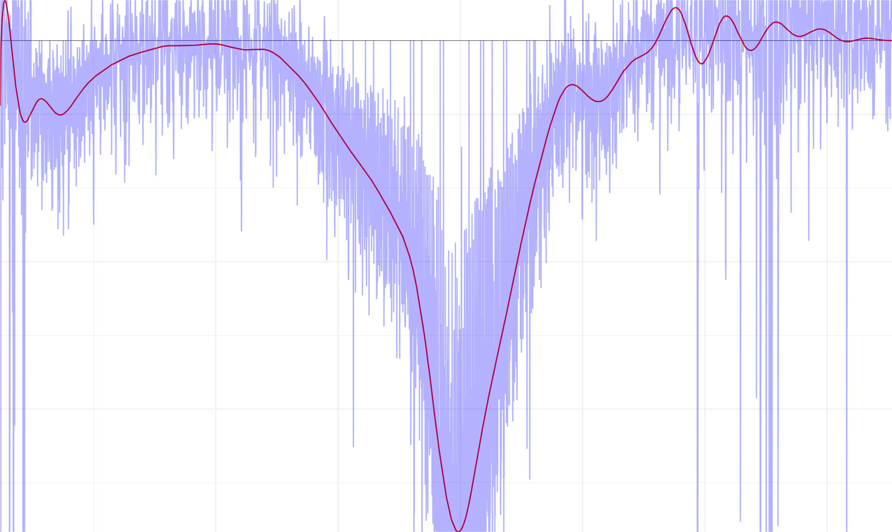

相对于惯性滤波较好的滤波效果：

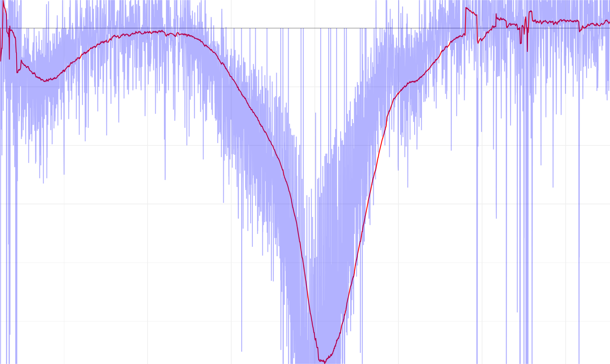

很明显`butter`滤波器的性能更好，噪音消除的更加彻底并且失真更小。

### 绘图说明

可通过引入`DataPloter`模块自定义绘图，例如：

```python
from DataPloter import DataPloter

file_path = Path('./data/test.txt')

ploter = DataPloter(file_path)
ploter.plot_TG(show_min=False) # 不显示TG最小点
ploter.plot_DTG()
ploter.plot_TG_DTG()
ploter.plot_unite(['name1', 'name2', 'name3']) # 输入自定义label
```

## 附录

### 绘图报告

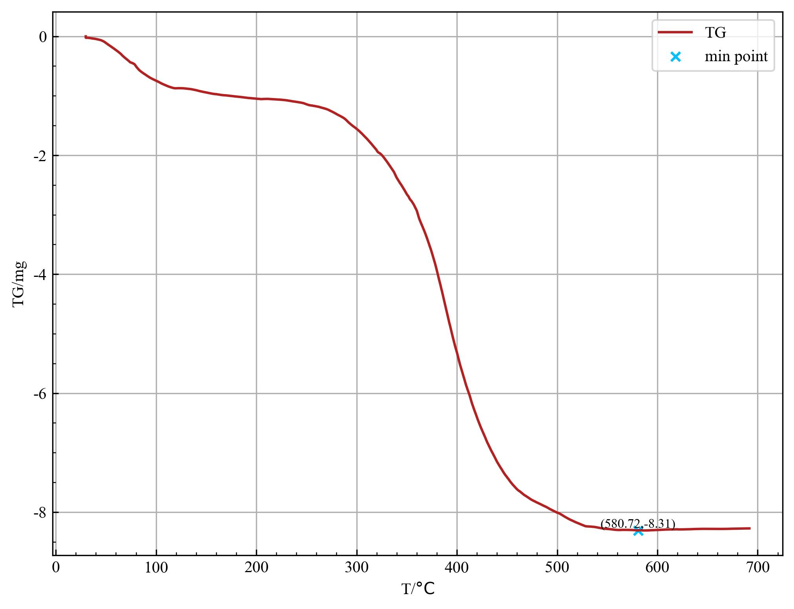

| TG_min | [580.72, -8.31] |
| ------ | --------------- |

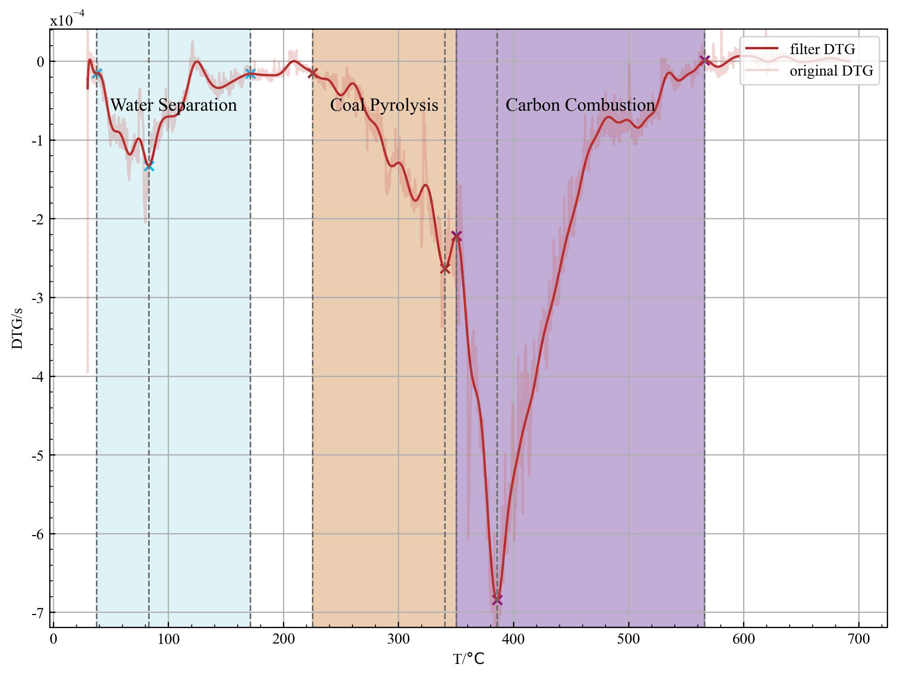

| water_separation  | 37.69~171.37  |
| ----------------- | ------------- |
| coal_pyrolysis    | 225.42~350.24 |
| carbon_combustion | 350.24~566.01 |

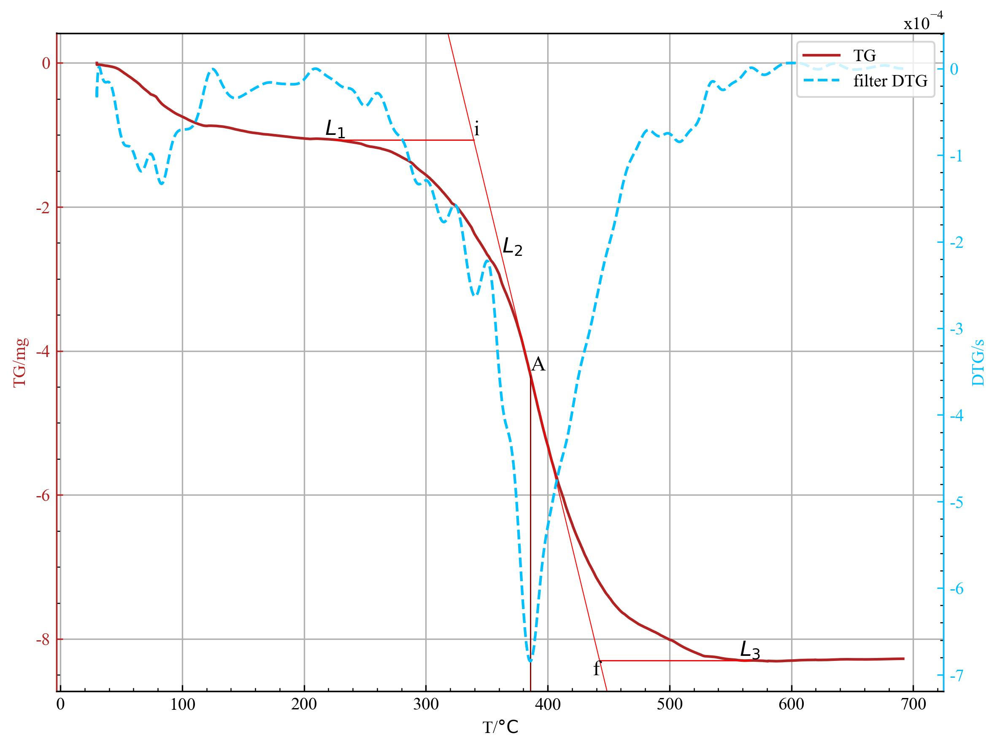

| T_i    | 339.19    |
| ------ | --------- |
| T_f    | 442.55    |
| T_p    | 385.87    |
| v_p    | 6.845e-04 |
| v_mean | 3.56      |

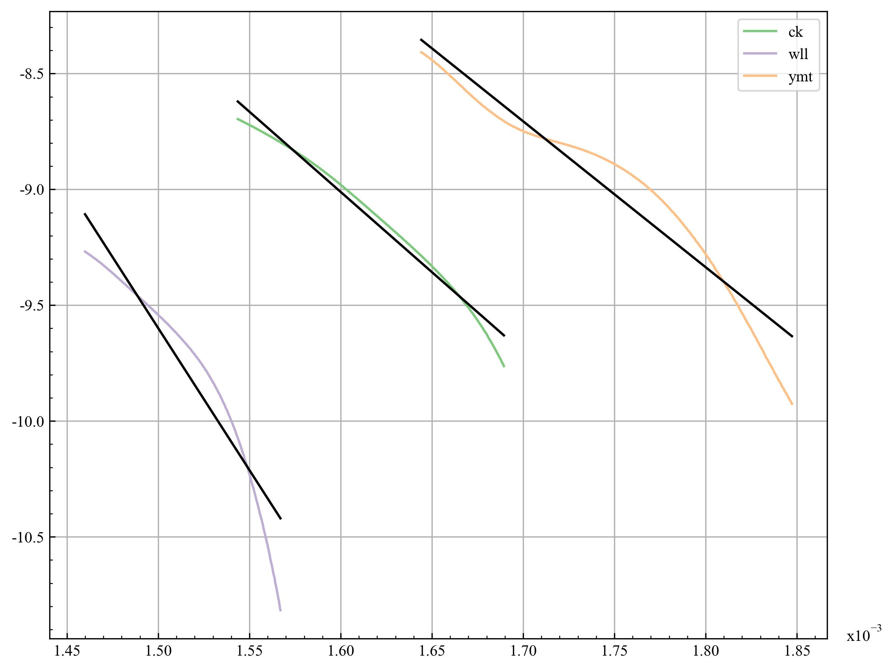

| T_min    | 591.92   |
| -------- | -------- |
| T_max    | 647.83   |
| A        | -6923.17 |
| b        | 2.07     |
| R_square | 0.982    |
| E        | 57559.25 |
| k0       | 7.89     |

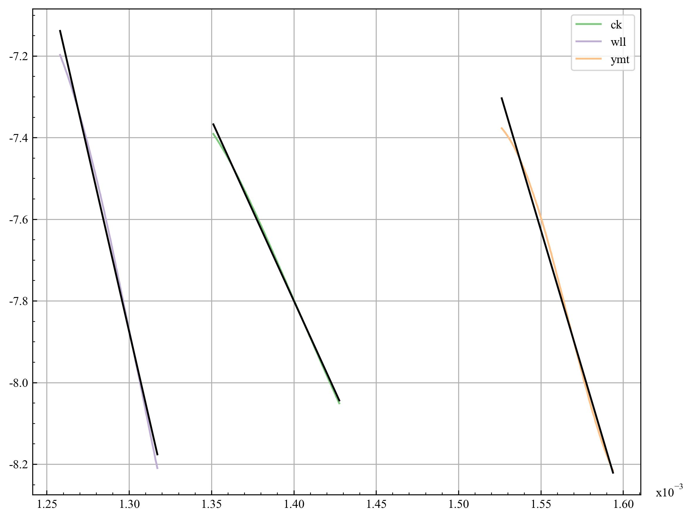

| T_min    | 700.46   |
| -------- | -------- |
| T_max    | 740.11   |
| A        | -8844.87 |
| b        | 4.58     |
| R_square | 0.999    |
| E        | 73536.24 |
| k0       | 97.84    |

### 代码样例

```python
from pathlib import Path

from FilterParameterSelect import select_filter_param
from FeaturePointSelect import select_feature_points
from PowerIntervalSelect import select_power_interval
from DocReporter import create_doc

file_path = Path('./data/tjh.txt')
# select_filter_param(file_path, method='inertial')  # 滤波参数选择器
# select_feature_points(file_path)  # 特征点选择器
# select_power_interval(file_path)  # 动力反应区间选择器
create_doc(file_path)  # 生成绘图报告
```

